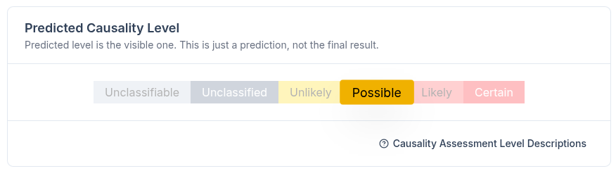
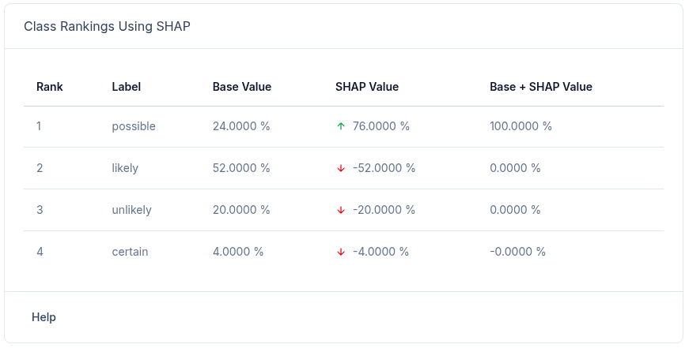
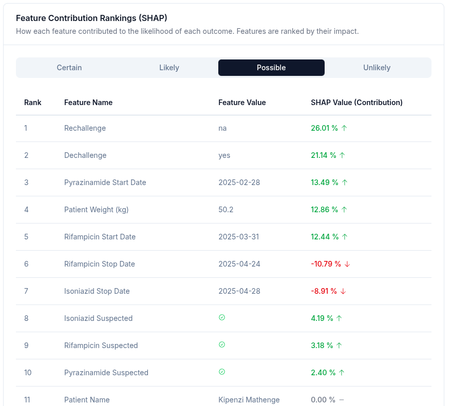

# MediLinda: AI-Powered Pharmacovigilance for Safer TB Treatment in Kenya

**MediLinda** is an integrated web platform that streamlines **Adverse Drug Reaction (ADR)** reporting, real-time monitoring, and **explainable AI-driven causality assessment** for Kenya’s Pharmacy and Poisons Board (PPB).

It directly addresses a **critical patient safety gap** in tuberculosis (TB) treatment:

> **First-line anti-TB drugs (Pyrazinamide, Ethambutol, Isoniazid, Rifampin)** are among the **most frequently reported for serious ADRs** in Kenya’s national pharmacovigilance database — yet manual causality assessment is **slow, subjective, and resource-constrained**.

## Demo screenshots

### Predicted Causality Assessment level



-   As per WHO-UMC Causality Assessment Levels

### Class Rankings using SHAP



| Term                  | Meaning                                                                        |
| --------------------- | ------------------------------------------------------------------------------ |
| **Base Value**        | Starting probability _before_ seeing patient data (from training set averages) |
| **SHAP Value**        | **How much this case's features _pushed_ each class up or down**               |
| **Final Probability** | Final confidence after applying evidence                                       |

### Feature Rankings per Causality Assessment Level using SHAP



**Top 5 reasons it said "possible":**

1. **No rechallenge** → **+26%**
2. **Symptoms improved after stopping** → **+21%**
3. **Reaction soon after Pyrazinamide** → **+13%**
4. **Low patient weight** → **+13%**
5. **Rifampicin started during reaction** → **+12%**

-   Other fields not shown to keep screenshot small

## The Business Problem We're Solving

### The Pain Point

-   **ADRs contribute to ~5% of global hospital admissions** (WHO, 2020)
-   In Kenya, **TB drugs dominate ADR reports** (PPB, 2023), but:
    -   Causality assessment is **manual, time-consuming, and inconsistent**
    -   **Expert shortages** delay signal detection
    -   **Poor communication** between regulators and remote facilities
    -   **Limited transparency** in decision-making erodes trust

### The Impact

Delayed or inaccurate causality assessment →  
**Prolonged patient exposure to harmful drugs** →  
**Avoidable morbidity, mortality, and healthcare costs**

## How MediLinda Solves It

| Challenge                             | MediLinda Solution                                                                             |
| ------------------------------------- | ---------------------------------------------------------------------------------------------- |
| **Slow & subjective causality**       | ML model predicts **WHO-UMC causality levels** (Certain → Unlikely) with **SHAP explanations** |
| **Expert overload**                   | AI assists — **not replaces** — PPB reviewers                                                  |
| **Poor visibility**                   | Real-time **interactive dashboards** for ADR trends, seriousness, outcomes                     |
| **Communication gaps in rural areas** | **Automated SMS alerts & follow-up requests** (80%+ mobile penetration in Kenya)               |
| **Low trust in AI**                   | **Explainable AI (XAI)** shows _why_ a prediction was made                                     |

> **Result**: Faster, consistent, transparent pharmacovigilance — **protecting TB patients nationwide**.

## Key Features

-   **ADR Reporting Portal**  
    User-friendly forms aligned with PPB’s PvERS workflow

-   **AI Causality Assistant**  
    Predicts causality + generates **SHAP explanation charts** for every case

-   **Monitoring Dashboard**  
    Visualize trends: drug-wise ADRs, seriousness, outcomes, reporting gaps

-   **SMS Communication Engine**  
    Auto-send alerts or request missing info from healthcare facilities

-   **Role-Based Access**  
    PPB Officers, Data Managers, Reviewers, Admins

## Data & Model Details

-   **Target**: WHO-UMC Causality Categories
-   **Dataset**: Synthetic ADR data modeled on PPB summary statistics (anonymized, realistic distributions)
-   **Model**: Gradient Boosting (handles class imbalance via imbalanced-learn)
-   **Explainability**: SHAP values per prediction — auditable by PPB experts
-   **Evaluation**: F1 > 0.78 on held-out synthetic test set (aligned with Kreimeyer et al., 2021)

## Built With Real-World Context

-   **Kenya PPB** – Official pharmacovigilance partner
-   **IntelliSOFT Consulting Ltd** – Health systems implementation
-   **University of Nairobi** – Academic research & evaluation

## Tech Stack

-   **Frontend:** Nuxt 3, TypeScript, Tailwind CSS, Nuxt UI
-   **Backend:** FastAPI, SQLAlchemy, Pydantic
-   **ML Pipeline:** scikit-learn, MLflow, SHAP, imbalanced-learn
-   **Database:** SQLite (dev), compatible with PostgreSQL
-   **Containerization:** Docker, docker-compose

## Getting Started

### Prerequisites

-   Node.js (v20+)
-   Python (3.11)
-   Docker & docker-compose (optional, for containerized setup)

### Setup

#### 1. Clone the repository

```sh
git clone https://github.com/yourusername/medilinda.git
cd medilinda
```

#### 2. Environment Variables

Copy `.env.example` to `.env` and fill in required values for both `client/` and `server/`.

#### 3. Install Dependencies

**Frontend:**

```sh
cd client
npm install
```

**Backend:**

```sh
cd ../server
uv pip install --system -r pyproject.toml
```

#### 4. Run the Application

**Development (separate terminals):**

-   Frontend:
    ```sh
    cd client
    npm run dev
    ```
-   Backend:
    ```sh
    cd server
    uvicorn src/server/main:app --reload
    ```

**Or with Docker Compose:**

```sh
docker-compose up --build
```

## Usage

-   Access the frontend at [http://localhost:3000](http://localhost:3000)
-   API available at [http://localhost:8000/docs](http://localhost:8000/docs)

## Project Structure

```
client/         # Nuxt 3 frontend
server/         # FastAPI backend
medilinda_ml/   # ML pipeline and model code
```

## Acknowledgements

-   Kenya Pharmacy and Poisons Board (PPB)
-   IntelliSOFT Consulting Ltd
-   University of Nairobi
